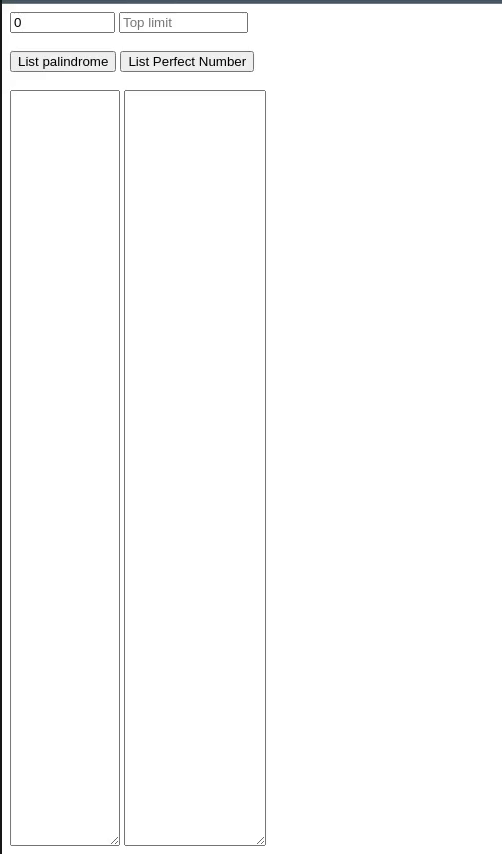

Clarusway

# JS-CC-09 : Palindromic and Perfect Numbers Lists

Purpose of the this coding challenge is to write a code that can list all the numbers in the given range, whether they are palindromic or perfect numbers.

# Expected Outcome
- 

**What is the palindromic numbers?**
> A palindromic number (also known as a numeral palindrome or a numeric palindrome) is a number (such as 16461) that remains the same when its digits are reversed. In other words, it has reflectional symmetry across a vertical axis. The term palindromic is derived from palindrome, which refers to a word (such as rotor or racecar) whose spelling is unchanged when its letters are reversed.  
The first 30 palindromic numbers (in decimal) are:

0, 1, 2, 3, 4, 5, 6, 7, 8, 9, 11, 22, 33, 44, 55, 66, 77, 88, 99, 101, 111, 121, 131, 141, 151, 161, 171, 181, 191, 202, … [Wikipedia](https://en.wikipedia.org/wiki/Palindromic_number) 

**What is perfect numbers?**
> Perfect Number: In number theory, a perfect number is a positive integer that is equal to the sum of its positive divisors, excluding the number itself. For instance, 6 has divisors 1, 2 and 3, and 1 + 2 + 3 = 6, so 6 is a perfect number. [Wikipedia](https://en.wikipedia.org/wiki/Perfect_number)

## Learning Outcomes

At the end of the this coding challenge, students will be able to;

- analyze a problem, identify and apply programming knowledge for appropriate solution.

- demonstrate their knowledge of algorithmic design principles by using JavaScript effectively.

## Problem Statement

- Take one or two inputs from user. List the results in the relevant fields using two different buttons.

- Examples:

  - if top low limit is 0 and limit value is 1000. List all palindromic and perfect numbers between 0 and 1000.

  - if top low limit is 50 and limit value is 100. List all palindromic and perfect numbers between 50 and 100.

 ⌛ Happy Coding  ✍ 

