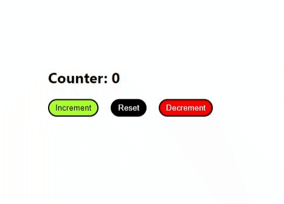

Clarusway

# Coding Challenge-004 : Simple Counter

## Description

Make a simple counter with three buttons.

## Problem Statement

- Make a simple counter. With increment, decrement and reset buttons.

## Expected Outcome

## Objective

With this code challenge, you can measure how quickly you can apply basic react concepts.

## Notes

- You can add additional functionalities and design to your app.

**
&#9786; Happy Coding &#9997;
**
